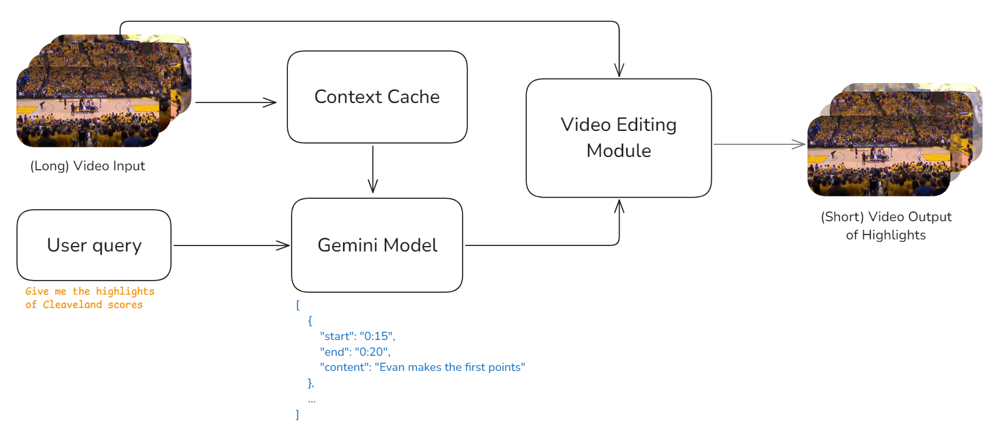

# Gemini-Video-Highlights
Gemini creates a short highlights video compilation of a given long video. This idea leverages Google's Gemini LLM, specifically its long attention and caching capabilities, to handle extensive video inputs effectively.

This is the code for the Kaggle competition: [https://www.kaggle.com/competitions/gemini-long-context](https://www.kaggle.com/competitions/gemini-long-context)

Submission for Diego Bonilla :D

Fingers crossed 🤞

## Summary
Gemini creates a short highlights video compilation of a given long video. This idea leverages Google's Gemini LLM, specifically its long attention and caching capabilities, to handle extensive video inputs effectively. Processing full-length videos requires the ability to maintain context over long durations, which is challenging for most language models. Gemini's advanced architecture makes it possible to analyze lengthy video content without losing track of important details, enabling comprehensive understanding and processing that would be difficult or impossible with standard models.

The proposed solution uses Gemini to generate a JSON of video highlights, each with start and end timestamps, content descriptions, and an importance score. An additional algorithm then trims the original video based on these highlights and overlays captions that summarize each section. By assigning importance scores, the model ensures that only the most significant parts of the video are included, allowing users to control the length and focus of the summary. Furthermore, since the context is cached, users can request more detailed analyses on specific topics within the video, enhancing the flexibility and usefulness of the summary.

